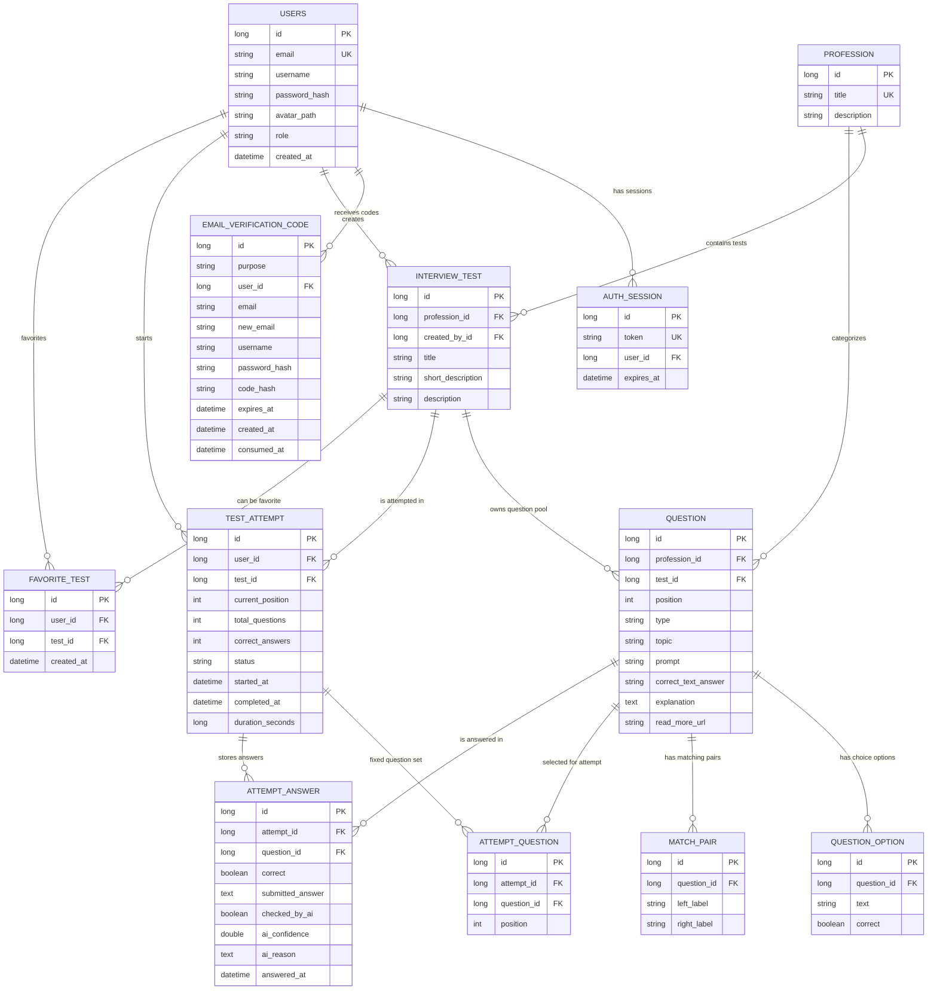

# Database Schema



## Notes

`PROFESSION` is the physical table name kept for compatibility. In the current product model it represents a strict programming language catalog:

```text
Python
Java
C++
C#
SQL
PHP
JavaScript
GO
```

`INTERVIEW_TEST` is a concrete test inside a language. Each test has its own question pool through `QUESTION.test_id`. The old idea of one shared question pool per profession/language is no longer used for attempt composition.

When a user starts an attempt, the backend selects questions only from the selected test's pool and stores the concrete selected set in `ATTEMPT_QUESTION`. This freezes the attempt, so later admin edits do not change already started attempts.

Current composition rule:

```text
up to 2 SINGLE_CHOICE
up to 2 MULTIPLE_CHOICE
up to 1 MATCHING
up to 2 SHORT_TEXT
```

If the test pool has fewer questions of a type, the backend takes all available questions of that type.

Correct answer storage depends on question type:

```text
SINGLE_CHOICE   -> QUESTION_OPTION.correct
MULTIPLE_CHOICE -> QUESTION_OPTION.correct
MATCHING        -> MATCH_PAIR.left_label + MATCH_PAIR.right_label
SHORT_TEXT      -> QUESTION.correct_text_answer
```

Explanations and resource links are generated by AI at answer time. `QUESTION.explanation` and `QUESTION.read_more_url` are nullable legacy-compatible columns and are not required from the admin client when creating questions.

`ATTEMPT_ANSWER` stores the submitted answer and AI-check metadata for short text answers:

```text
checked_by_ai
ai_confidence
ai_reason
```

`TEST_ATTEMPT.duration_seconds` stores the total completion time. API responses format it as `HH.MM.SS` and also compute the user's best time for the same test.

`EMAIL_VERIFICATION_CODE` is used for registration confirmation, password reset, password change from profile, and email change. For pending registration it temporarily stores `username` and `password_hash` until the email code is confirmed.

Roles are stored in `USERS.role`:

```text
USER
ADMIN
SUPER_ADMIN
```

`INTERVIEW_TEST.created_by_id` is used for admin ownership. `ADMIN` can manage only own tests, while `SUPER_ADMIN` can manage all tests and users.

`FAVORITE_TEST` has a unique constraint on `(user_id, test_id)`, so one user cannot add the same test to favorites twice.

Avatar files are stored on disk, not in the database. `USERS.avatar_path` stores only the saved file name/path fragment used by `/api/profile/avatar/{fileName}`.

Public endpoints do not expose correct answers. Correct flags and text answers are returned only from admin endpoints.
