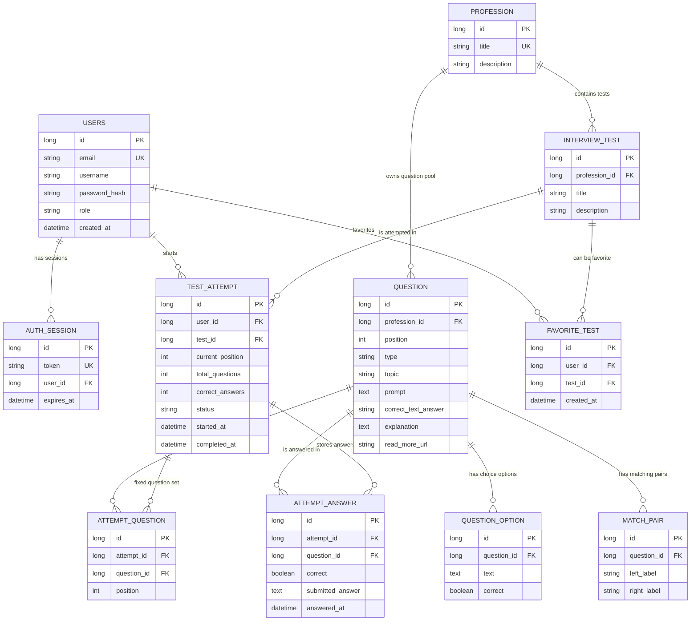

# Database Schema



## Notes

`QUESTION` belongs to a profession question pool, not directly to a test.

When a user starts an attempt, the backend selects questions from the profession pool and stores the concrete selected set in `ATTEMPT_QUESTION`.

Current composition rule:

```text
up to 2 SINGLE_CHOICE
up to 2 MULTIPLE_CHOICE
up to 1 MATCHING
up to 2 SHORT_TEXT
```

If the pool has fewer questions of a type, the backend takes all available questions of that type.

Correct answer storage depends on question type:

```text
SINGLE_CHOICE   -> QUESTION_OPTION.correct
MULTIPLE_CHOICE -> QUESTION_OPTION.correct
MATCHING        -> MATCH_PAIR.left_label + MATCH_PAIR.right_label
SHORT_TEXT      -> QUESTION.correct_text_answer
```

Public endpoints do not expose correct answers. Correct flags and text answers are returned only from admin endpoints.
